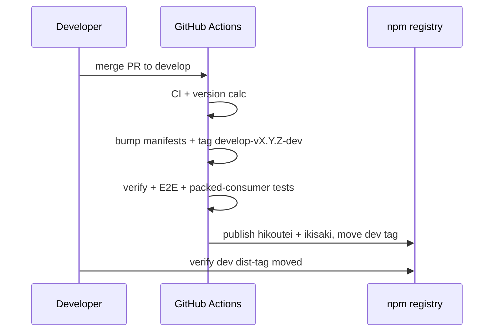
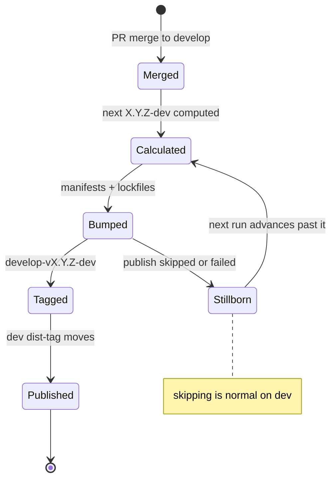

# Release process

Two channels, two audiences:

| Channel | Source | npm dist-tag | Audience |
| ------- | ------ | ------------ | -------- |
| Stable | `main` | `latest` | Production consumers |
| Dev | `develop` | `dev` | Pre-release verification (`@hikoutei/ikisaki` publishes its own `dev` tag in the same run) |

`latest` is reserved for the stable channel. Dev versions are consumable
checkpoints, not promises: version numbers on the dev channel are disposable.

## Version form

Each `develop` merge advances the patch line from the stable base with a
fixed bare `-dev` suffix: latest `0.10.0` → `0.10.1-dev`, then `0.10.2-dev`.
The number marches forward from `max(published latest, published dev)`.

Skipped numbers are normal, not broken. If a version is bumped and tagged
but never published (a "stillborn" release — e.g. `0.10.2-dev`), the next
run advances past it (`0.10.3-dev`) instead of retrying or moving the tag.
Tags are immutable once pushed; the pipeline only moves forward.

Legacy `develop-vX.Y.Z-dev.N` tags are rejected by the publish workflow.
The two formats never mix.

## Pipeline

## Workflows

| Workflow | Trigger | Role |
| -------- | ------- | ---- |
| `ci.yml` | PR + `develop` push | Unit, typecheck, build, E2E, packed-consumer smoke |
| `develop-version.yml` | `develop` push (paths-filtered) | Verify merge commit, compute version, bump + tag |
| `develop-publish.yml` | `develop-v*` tag push (+ manual tag recovery) | Verify tag tree, E2E, publish root + kernel, move `dev` tag |
| `main-version.yml` / `stable-publish.yml` | `main` | Stable line (`latest`) |
| `ikisaki-publish.yml` | Manual dispatch | Kernel-only stable publish |
| `hikoutei-tag-publish.yml` | Manual | Per-PR recovery publish |

`develop-version.yml` ignores pushes that touch only `.github/**`, `docs/**`,
`website/**`, or `README.md`. A workflow-only merge produces no release run
by design — the fix rides with the next content merge.

Releases serialize on the `release-develop` concurrency group
(`cancel-in-progress: false`). The version job aborts fail-closed with
`develop advanced before release preparation` if `develop` moved under it —
that means "merge later," not "retry now."

## Merge protocol (stacked PRs)

Merge strictly one PR at a time: merge → wait for the version bump commit
and tag → wait for the publish run → confirm `npm view hikoutei dist-tags`
shows the new `dev` version → merge the next. Back-to-back merges race the
version calculation and swallow deployments.

## Failure → recovery

| Symptom | Cause | Recovery |
| ------- | ----- | -------- |
| `TS2724` / `ETARGET` on a workspace pin | Exact pin trails the workspace version, so the resolver falls back to the stale registry tarball (or dies if the pinned version was never published) | Align the pin to the workspace version + regenerate both lockfiles; never publish around it |
| `npm error Version not changed` in version calc | Stillborn version: bump committed but never published, so the same number recomputes | Merge forward — the pipeline advances past it automatically; do not move the tag |
| `ETARGET` inside the kernel bump | `npm version -w` re-resolves the tree mid-bump; unpublished pins cannot resolve | Bump via manifest edit (current behavior); keep it that way |
| No release run after merge | Paths-filtered merge, or head commit is itself a release bump | Expected; the next content merge triggers |
| Re-run of a failed release | Re-runs execute the old code at the old commit | Never the fix for deterministic failures — merge the fix forward instead |
| Red `develop` tip | Any of the above on the tip commit | No dev publish can happen until the tip is green; fix forward, oldest blocker first |

Root verification commands: `npm test`, `npm run typecheck`,
`npm run typecheck:test`, `npm run build`, `npm pack --dry-run`.
